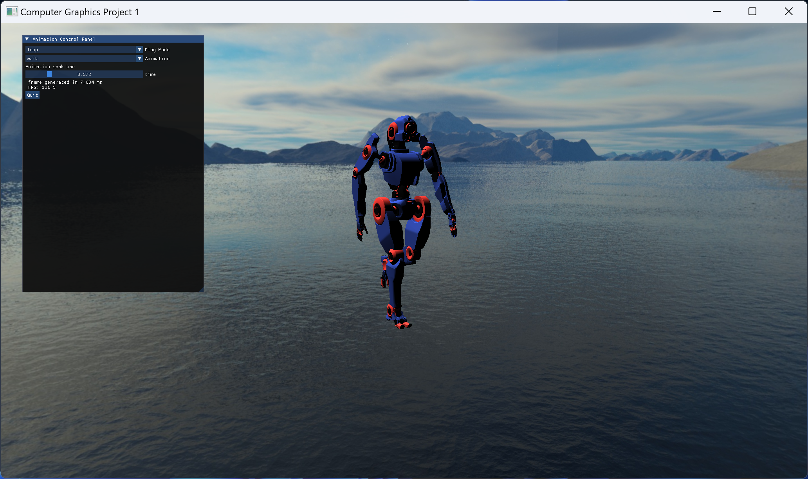

# Project01
CS2902701 基礎電腦圖學實習 Project 01

使用C++ OpenGL製作機器人動畫，並實作選擇、載入、編輯動畫的圖形介面。
### 螢幕截圖

### 使用庫
1. [glad](https://glad.dav1d.de/)
2. [glfw](https://www.glfw.org/)
3. [glm](https://github.com/g-truc/glm)
4. [Dear ImGui](https://github.com/ocornut/imgui)
5. [assimp](https://github.com/assimp/assimp)
